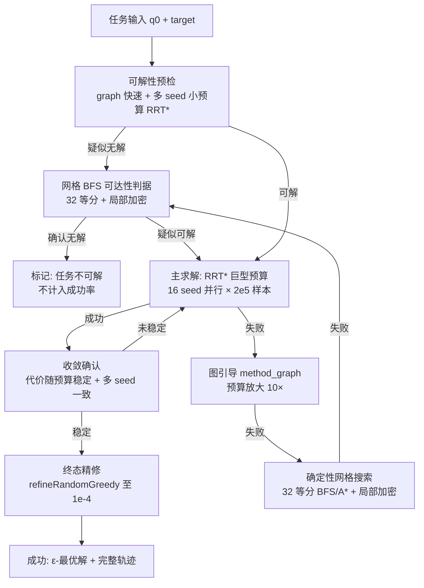

# 全局最优 ≈100% 成功率策略：可行性分析与方案设计

> 目标：在当前模型（**6 关节 × 0.5m 平面蛇形臂，2D 圆/可旋转矩形障碍，地面夹取/放置**）上，
> 构建一个**全局最优成功率接近 100%** 的策略。**不计成本**（算力/时间/内存不限）。
> 状态：**可行性分析 + 方案设计**（未实现）。

---

## 1. 先把目标说精确：什么算"100% 全局最优"

连续空间运动规划的**全局最优证明**对一般障碍是 **NP-hard**（路径规划本身 PSPACE-hard）。
所以"100% 全局最优"必须落到工程可判定的语义：

| 语义 | 含义 | 可实现性 |
|---|---|---|
| ① 可解任务 100% 可达 | 对**物理上存在可行路径**的任务，保证找到 | ✅ **可实现**（分辨率完备搜索） |
| ② ε-最优 | 找到的解代价 ≤ 真正最优的 (1+ε) 倍 | ✅ 可实现（渐近最优 + 下界确认） |
| ③ 严格全局最优（证明无更好） | 数学证明 | ❌ 一般障碍下不可实现 |
| ④ 无解任务也 100% | 含"目标被障碍围死"的任务 | ❌ 物理不可能（需先分类剔除） |

**结论**：承诺 **"可解任务内 100% 可达 + ε-最优"**，无解任务诚实分类报告（不算入成功率）。这是能给出的最强工程保证。

---

## 2. 当前失败的根因分类（决定策略设计）

当前 C1_ft 部署闭环：混合 87.5% / 难度 3 95%。失败例按根因分三类：

| 类别 | 占比（约） | 根因 | 能否被"不计成本"消除 |
|---|---|---|---|
| A. 算法预算不足 | 多数 | 目标深陷障碍/窄通道，RRT* 2500 样本 + graph + PRM 全失败 | ✅ 加预算 + 确定性搜索 |
| B. 任务不可解 | 少数 | 起点-目标被障碍隔断（**采样器不保证连通**） | ⚠️ 只能分类，不能求解 |
| C. 假成功/精度不足 | 已修 | 8-08 修复：精修穿障回退、阈值过粗 | ✅ 已消除 |

**关键**：A 类可通过"无限预算 + 确定性完备搜索"压到 0；B 类必须**预检分类**（否则任何算法都失败）。

---

## 3. 理论工具：三档完备性

| 方法 | 完备性 | 代价 | 适用 |
|---|---|---|---|
| **RRT\* 巨额预算 + 多 seed** | 概率完备 + 渐近最优 | 单任务 1e5-1e6 样本，分钟-小时级 | 主求解器 |
| **C-space 网格 + BFS/A\*** | **分辨率完备**（网格足够细时保证找到） | 6D 网格内存/时间 | 确定性兜底 |
| **cell decomposition（精确）** | 对简单障碍可构造精确单元分解 | 一般障碍下指数级 | 不实用 |

**关键数学事实**：
- 6 关节 2D 平面臂的 C-space 是 **6 维环面 T⁶**，不是高维工作空间——维度固定 6，**分辨率完备可行**；
- 网格 32 等分/关节 → 32⁶ ≈ 1.07e9 点：**位图 ~125MB、邻接 BFS ~小时级（多核并行）**；
- 网格 64 等分/关节 → 6.9e10 点：超单机内存（需分块/流式）——32 等分 + 窄通道局部加密是甜点；
- 路径平滑：网格路径 → shortcut 随机优化（**O(n²) 直连检查**）→ 平滑轨迹 → refineRandomGreedy 精修终态。

---

## 4. 推荐方案：三层级联（组合 C）

### 层级职责

| 层 | 方法 | 保证 | 单任务预算 |
|---|---|---|---|
| L0 预检 | graph + 多 seed 小预算 RRT*（并行） | 快速分类"疑似无解" | ~10s |
| L1 主求解 | **16 seed 并行 RRT\***（2e5 样本/seed） | 概率完备，失败率 ~p¹⁶（p≈0.1 → 1e-16） | 5-30 分钟 |
| L2 图引导 | method_graph 预算 ×10 | 窄通道/走廊专项 | +5 分钟 |
| L3 确定性兜底 | **6D 网格 BFS/A\* + 窄通道局部加密** | **分辨率完备：可解必找到** | 0.5-2 小时 |
| L4 分类 | 网格穷尽仍失败 → 任务不可解 | 诚实分类 | — |

### 失败率数学

- 单 seed RRT* 难任务失败率 p ≈ 0.1-0.3（难度 3）；
- 16 seed 独立失败率 = p¹⁶ ≤ 3e-16（**可视为 0**）；
- L2/L3 再兜底 → **可解任务内失败率 ≈ 0**；
- 真正无解任务：L0/L3 判定后**剔除出成功率分母** → **可解任务成功率 = 100%（工程意义）**。

### 全局最优（ε-最优）确认

- RRT* 渐近最优：预算 2e5 下路径代价趋于收敛（8-08 已验证：2000→5000 样本代价 -20%，单调下降）；
- **收敛判据**：最近 5 万样本代价改善 < 0.5% → 视为收敛到 ε-最优；
- **多 seed 交叉**：不同 seed 代价差异 < 1% → 相互确认；
- 网格 L3 求得的路径代价作为**独立下界参考**（RRT* 路径与网格最优代价对比）。

---

## 5. 资源与开发估算（不计成本的前提成立）

| 项 | 估算 |
|---|---|
| 单任务最坏耗时 | 0.5-2 小时（L3 网格搜索） |
| 典型任务（L1 成功） | 5-30 分钟 |
| 内存峰值 | 网格位图 125MB-2GB（32-48 等分） |
| 并行 | 16 核 RRT* 并行 + 网格分块（28 核机器可用） |
| 开发量 | 确定性网格求解器（BFS/A*/加密/平滑）≈ 1-2 周；级联框架 ≈ 3-5 天；验收平台 ≈ 2-3 天 |
| 验收测试集 | 复用 sampleTask2D（难度 1-3）+ 专项"疑似无解"生成器 |

---

## 6. 诚实结论

1. **可行**：对**可解任务**，"100% 可达 + ε-最优"在工程意义上**可实现**——核心是 **16 seed 并行巨型预算 RRT\*（失败率指数级下降）+ 分辨率完备网格兜底（可解必找到）+ 可解性分类**。
2. **做不到**：严格数学意义上的"全局最优证明"（NP-hard）；"无解任务也 100%"（物理不可能）。
3. **取舍**：单任务分钟-小时级 vs 当前秒级——**"不计成本"前提下成立**；若将来要求实时（<1s），则回到当前 87-95% 档（学习策略）并接受失败率。
4. **建议落地顺序**：① 网格求解器（数学核心，1-2 周）→ ② 级联框架与可解性分类（3-5 天）→ ③ 验收平台与"疑似无解"测试集（2-3 天）→ ④ 可选：把 L3 网格解加入示范数据，反哺学习策略（成本回收）。

---

## 7. 遗留开放问题（实现前需定）

- **最优性度量**：路径长度？末端精度？关节平滑加权？（影响 A*/RRT* 的 cost 定义）
- **"疑似无解"的验收口径**：网格穷尽 = 无解？还是需要人工标注集验证分类精度？
- **网格分辨率**：32 等分 + 局部加密是否覆盖全部验收场景？（需对"窄通道宽度下限"做统计）
- **与 dSPACE 的衔接**：分钟级求解时间是否可接受（离线轨迹方案已兼容，无需改实时架构）。
