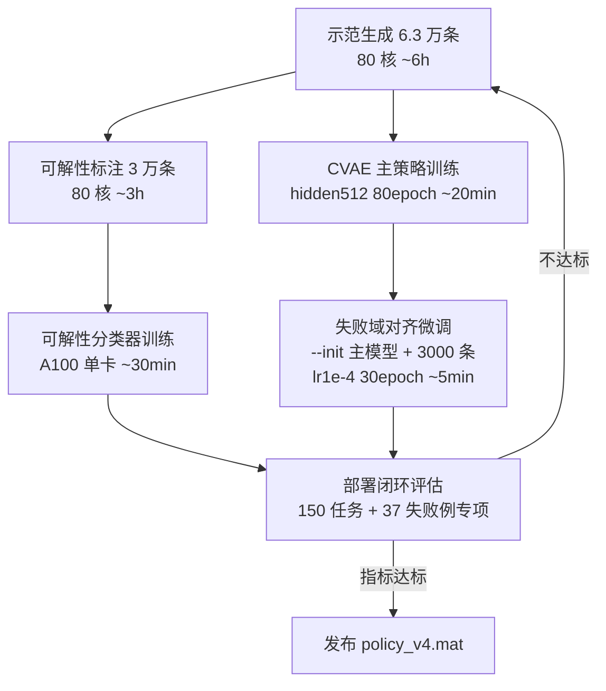

# 新策略训练方案（云服务器 · 真实臂长口径）

> 背景：真实机械臂单节 **1043.93mm × 6**（总臂长 6.26m）；P0 可行性验证已确认"目标对齐示范"有效（扰动变体无效）；8.7% 任务疑似不可解（需可解性分类器）；顶层闭环（runTopLevel）已具备（反馈/手眼/目标估计）。
> 目标：在云服务器（4×A100 + 80 核）上训练**新臂长口径**的全局最优避障策略，成功率 ≥95%（可解任务）、直出率 ≥80%、末端精度 ≤1cm、在线推理 <1s。

---

## 1. 与旧口径的关键差异

| 项 | 旧（0.5m×6） | 新（1.04393m×6） |
|---|---|---|
| 总臂长 | 3m | 6.26m |
| 栅格 | GRID=32、EXTENT(-2,4,-2.5,2.5) | **GRID=64、EXTENT(-5,9,-7,7)**（0.22m/格） |
| 障碍分布 | R 联动（0.10-0.22R） | **自动缩放（R=6.26）**——无需改采样器 |
| 示范/模型 | 全部 0.5m 口径（作废） | **全部重新生成** |

## 2. 数据管线（80 核并行，云上）

### 2.1 主示范（难度 1-3 混合）——6 万条
```
sampleTask2D(difficulty=0, L_seg=1.04393) × 60000
→ method_rrtstar(max_samples=8000, 预算内最优) → optimizeTraj(短切 600)
→ demonstrations_main/
```
- 并行：80 核 ≈ 60-70 MATLAB 实例 → 单条 ~20s → **6 万条 ≈ 5-6 小时**
- 复用 generateDemonstrations（参数已切新臂长）

### 2.2 失败域对齐示范——3000 条（P0 验证的核心结论）
```
步骤 1: 主示范采样时记录"部署闭环失败"任务（collectFailures 逻辑，~12%）
步骤 2: 对失败例做可解性诊断（多 seed 巨型预算 RRT*）
步骤 3: 可解失败例 → 目标不扰动（!）多 seed 重解示范 → demonstrations_fail/
```
- **铁律**：目标 ±0m 扰动（P0 证明扰动导致分布漂移无效）；可扰动 q0±0.3 / 障碍±0.03（小）

### 2.3 可解性标注集——3 万条（P1 数据）
```
3 万任务 × 多 seed 巨型预算（2e4）→ 可解/不可解 二分类标签
→ 训练 可解性分类器（CNN 栅格 + MLP(q0,target)）
```

## 3. 模型栈（A100 训练）

| 模型 | 架构 | 输入 → 输出 | 作用 |
|---|---|---|---|
| **主策略 CVAE** | hidden 512、d_z=32 | 64×64 栅格 + q0[6] + tgt[3] → 64 步增量轨迹 | 直出候选轨迹（多模态） |
| **可解性分类器** | CNN(64×64→128) + MLP | 栅格 + q0 + tgt → P(可解) | 毫秒预检，不可解任务直接拒绝 |
| **代价引导网络**（可选 P2） | MLP 256 | 栅格 + q0 + tgt → V̂(最优代价) | RRT* 有向采样启发式（回退加速） |

**关键架构决策**：
- CVAE 增量表示（`traj = q0 + cumsum(Δ)`）——已验证（旧模型必须）
- 潜空间优化推理（多候选 z + 数值梯度）——已验证
- 可解性分类器输出**软概率** → 部署时同时作"直出置信度"（P(可解)<0.5 时优先回退而非硬拒绝）

## 4. 训练流程（云上，分阶段）



- 全程脚本：`train_cvae.py`（GPU 已就绪）+ 新 `train_solvability.py` + 评估脚本
- **消融**：4×A100 并行 4 组（不同 seed/数据配比）→ 取 val 最优

## 5. 评估与验收（新臂长口径）

| 指标 | 目标 | 测试集 |
|---|---|---|
| 可解任务成功率 | **≥95%** | 150 混合 + 难度 3 专项 20 |
| 直出率 | **≥80%** | 同测试集（毫秒级直出占比） |
| 末端精度 | ≤1cm（pos<0.01） | 全任务 |
| 碰撞 | 0 | 全程 obsDistAll 检查 |
| 在线耗时 | <1s | 部署闭环均值 |
| 不可解任务拒绝率 | ≥95% | 26 例专项（P1 分类器） |

## 6. 部署集成

```
cvaePolicyDeploy v4：
  P(可解) < 0.3 → 直接拒绝（毫秒级，不算失败）
  直出 → 验证（穿障/误差>0.08 回退）→ auto 链兜底
  + 顶层闭环：runTopLevel 提供目标位姿（视觉-运动融合）→ 触发任务
```

## 7. 资源与里程碑

| 阶段 | 内容 | 云上耗时 | 累计 |
|---|---|---|---|
| M1 | 示范生成 6.3 万条 | ~6h | 6h |
| M2 | 可解性标注 3 万条 | ~3h | 9h |
| M3 | 可解性分类器 + CVAE 训练 | ~1h | 10h |
| M4 | 失败域微调 + 消融 | ~1h | 11h |
| M5 | 评估调优迭代 | ~2h | 13h |
| **合计** | | **约 13-15 小时** | |

## 8. 风险与预案

| 风险 | 预案 |
|---|---|
| 新臂长下障碍相对稀疏 → 难度不足 | difficulty=3 专项加大（c3 类数据扩到 1 万条） |
| 可解性分类器误拒绝可解任务 | 阈值保守（P<0.3 才拒绝）+ 拒绝任务进人工复核集 |
| 64×64 栅格直出率下降（分辨率变化） | 消融 32×32 vs 64×64；不行则双分辨率输入 |
| 云上 MATLAB 许可不可用 | 示范生成留本地（80 核云只做训练），流程不变 |
| 闭环数据利用 | M4 后可叠加 runTopLevel 真实执行反馈做在线微调（增量学习预留） |
