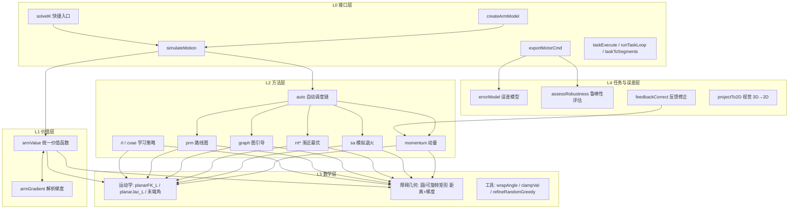
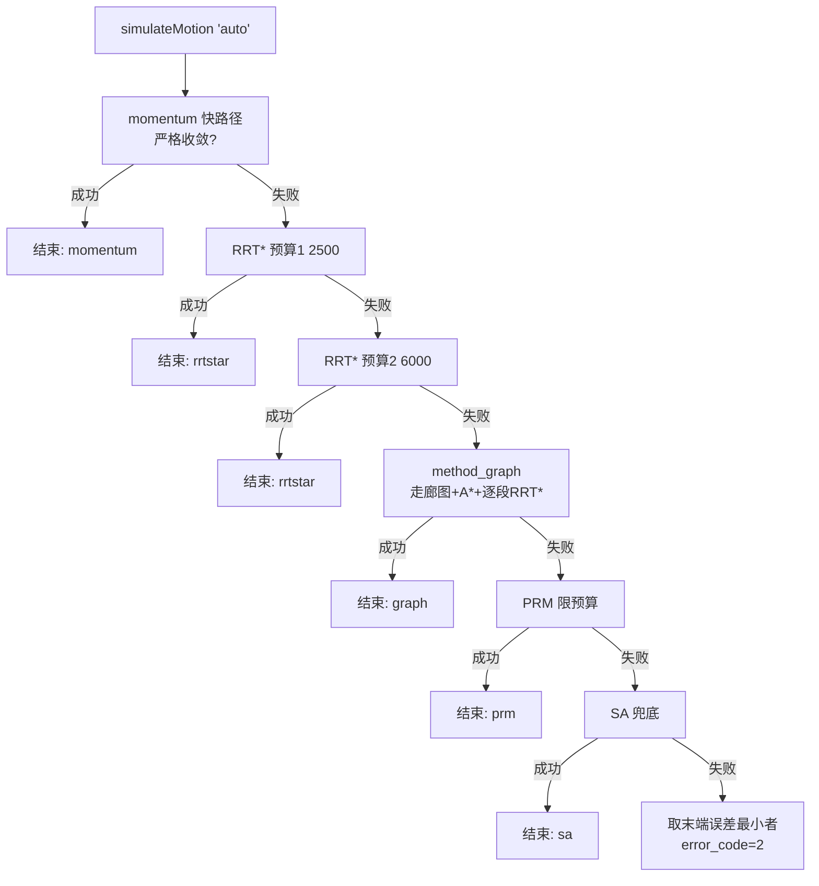
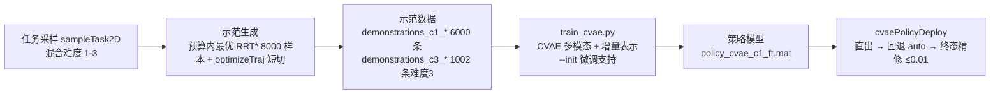
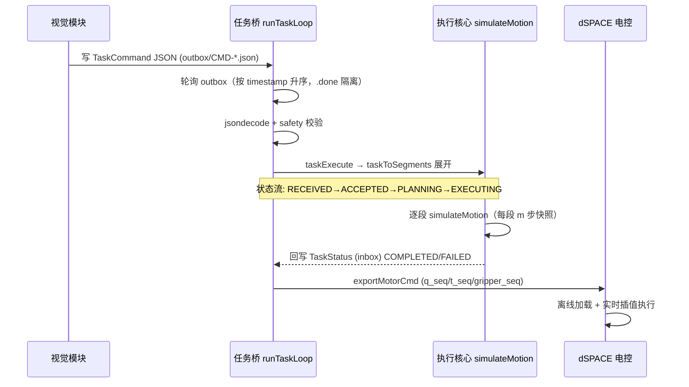

# 系统架构与接口总览

> 本文档是 **当前模块（平面蛇形机械臂 IK 求解与仿真）与整体机械臂系统** 的完整功能、接口与概念逻辑总览。
> 面向：新成员快速上手、跨模块对接、架构评审。详细设计见《实现方案.md》，dSPACE 对接见《电控对接说明.md》。

---

## 1. 系统全景

机械臂执行任务的完整链路：**视觉感知 → 任务下发 → 本模块（规划+仿真） → 电控执行**。

```mermaid
graph LR
    subgraph 上游:视觉模块
        CAM[D405 相机<br/>白点/ArUco/YOLO 检测]
        UI[SpaceSnakeVisionUI<br/>PySide6 界面]
        VIS[TopStateTask<br/>任务编排]
    end

    subgraph 本模块:MATLAB 规划与仿真
        BRIDGE[任务桥<br/>taskExecute / runTaskLoop]
        CORE[ArmSimulator2D 核心<br/>价值函数 + 6 种求解方法 + auto 调度]
        SIM[虚拟仿真<br/>ArmSimApp GUI]
        L2[L2 学习管线<br/>示范生成 → CVAE 训练 → 部署]
    end

    subgraph 下游:电控
        DSPACE[dSPACE 平台<br/>离线加载 motorCmd]
        ARM[真实机械臂<br/>6 轴 + 夹爪]
    end

    CAM -->|目标位姿 3D| UI
    UI -->|TaskCommand JSON| BRIDGE
    VIS -->|任务列表/安全标志| BRIDGE
    BRIDGE --> CORE
    SIM <-->|可视化/人工干预| CORE
    L2 -->|策略模型 policy_cvae_c1_ft.mat| CORE
    CORE -->|motorCmd: q_seq/t_seq/gripper_seq| DSPACE
    DSPACE -->|关节角/夹爪指令| ARM
    ARM -.->|编码器反馈(预留)| CORE

    style CORE fill:#1a3a5c,stroke:#4da6ff
    style BRIDGE fill:#2d4a2d,stroke:#6fbf6f
```

> **关键边界**：
> - 障碍**仅存在于本模块仿真**（圆/可旋转矩形），视觉不传障碍；
> - 夹爪 = 简单状态机（`gripper_seq`），由 dSPACE 电控实现；
> - 电控运行在 **dSPACE 仿真平台**，本模块输出**离线轨迹文件**（IK 不进实时循环）；
> - 真实机械臂未交付、无 dSPACE 硬件前，联调在**虚拟仿真框架内**完成。

---

## 2. 本模块内部架构



| 层 | 职责 | 关键文件 |
|---|---|---|
| **接口层** | 对外统一入口、任务桥、指令导出 | `createArmModel.m` `simulateMotion.m` `solveIK.m` `taskExecute.m` `runTaskLoop.m` `exportMotorCmd.m` |
| **价值层** | 单一标量势 + 解析梯度（机器精度校验） | `armValue.m` `armGradient.m` |
| **方法层** | 6 种求解器 + 自动调度 | `method_momentum/sa/rrt/rrtstar/graph/prm/rl.m` `method_auto.m` |
| **数学层** | 运动学正解/雅可比、障碍几何距离与梯度 | `planarFK_L.m` `planarJac_L.m` `obsDistAll.m` `obsDistGradAll.m` `segSegDistGrad.m` 等 |
| **任务/误差层** | 视觉投影、误差建模、鲁棒性、反馈 | `projectTo2D.m` `errorModel.m` `assessRobustness.m` `feedbackCorrect.m` |
| **L2 学习层** | 示范生成 → CVAE 训练 → 部署闭环 | `generateDemonstrations.m` `sampleTask2D.m` `rl_pipeline/train_cvae.py` `cvaePolicyDeploy.m` |
| **GUI** | 虚拟仿真窗口（障碍/目标/机械臂可视化编辑） | `ArmSimApp.m` |

---

## 3. 外部接口契约

### 3.1 上游：TaskCommand JSON（文件桥 data/outbox ⇄ inbox）

```json
{
  "timestamp": 1723000000.0,
  "command_type": "pick_and_place",      // 见下表
  "target_id": "T-01",
  "target_pose": {"x": 1.2, "y": 0.8, "yaw": 0.0, "z": 0.0},
  "frame_id": "camera_left",
  "extra": {}
}
```

| `command_type` | 语义 | 展开动作（taskToSegments） |
|---|---|---|
| `move` | 运动到目标 | 单段：起点→目标 |
| `pick_and_place` | 夹取-放置 | 夹取(下降+闭合)→抬升→移动到放置点→下降→张开 |
| `pick` / `place` | 单独夹取/放置 | 对应半程 |
| `home` | 归位 | 回到原点位形 |

夹爪状态机：`[0 2 0 0 1]`（0=保持 1=张开 2=闭合，按任务类型生成 `gripper_seq`）。

### 3.2 本模块入口

**`model = createArmModel(params)`**
- `params.N`（关节数）、`L_seg`（体节长）、`q_limits`（电机区间，缺省用默认）、`obstacles`（`.circles [x,y,r]` / `.rects [x,y,θ,w,h]`）、权重 `w_pos/w_ang/w_obs/w_var/w_acc`、容差 `tol_pos/tol_ang`、`dq_max` 等；缺省字段自动兜底。

**`info = simulateMotion(model, method, q0, target, 'Snapshot', m)`**
- `q0` 兼容 `[1×N]` 关节角 或 `[x,y,θ]` 位姿（自动反解）；
- `method` ∈ `momentum / sa / rrt / rrtstar / prm / graph / rl / cvae(策略文件) / auto`；
- 返回字段：

| 字段 | 含义 |
|---|---|
| `q_snapshot [K×N]` | **每 m 步关节角快照 = 电机指令序列**（回放/下发用） |
| `t_seq [1×K]` | 相对时间节拍（`t_accum += min(1, ‖v‖/dq_max)`） |
| `q_final` | 终态关节角（回放末帧与之一致） |
| `success / error_code` | 成功标志与错误码（见 §6） |
| `vel_ok / safety_ok` | 速度（dq_max）/ 安全距离（rho0）双层校验 |
| `method_used` | auto 链实际使用方法 |
| `stats` | 方法诊断（节点数/边数/路径代价/候选等） |
| `V_hist` | 价值函数历史（收敛可视化） |

### 3.3 下游：motorCmd 导出（exportMotorCmd）

```matlab
exportMotorCmd(info, 'motorCmd.mat', 'GripperSeq', gs, 'Meta', meta);
```

输出文件字段（与《电控对接说明.md》§2.1 一致）：

```
q_seq [K×N] / t_seq [1×K] / gripper_seq [1×K] / dq_max
vel_ok / safety_ok / success / error_code / q_final / meta
```

同时导出 `.csv`（表头 `t,q1..qN,gripper`）供文本检查。电控端：**离线加载 → 按 t_seq 实时插值执行**。

---

## 4. 概念逻辑图

### 4.1 统一价值函数（所有方法共享单一标量势）

```
V(q) = w_pos · ‖p − X_t‖²     末端位置误差（X_t = 任务目标）
     + w_ang · wrap(θ − θ_t)²  末端角度误差
     + w_obs · Σ [log(r_bar) − log(g_eff)]   障碍对数屏障（仅 g_eff < r_bar 激活，
                                              g_eff = max(d − d_safe, g_min)，侵入饱和排斥）
     + w_var · Σ(q−μ)²/σ²     关节先验（默认关闭，避免与位置项伪平衡）
```

- 全空间 **连续平滑**（真实几何距离 + wrap 恒开 + 梯度截断恒开）；
- 解析梯度（`armGradient`）机器精度校验通过（~5e-8，阈值 1e-6）；
- 动态权重调度：`w_ang *= (0.5+1.5·(1−s))`，`s = min(1, dist_end/0.15)`——打破位置-角度梯度互消。

### 4.2 收敛判定矩阵（不同方法不同语义，GUI 按实际方法显示）

| 方法 | 收敛判据 | 精度 |
|---|---|---|
| momentum（严格） | 硬达标 `dist<tol_pos(1e-4) && ang<tol_ang(1e-3)`；卡住早停 | 1e-4 级 |
| momentum（动态） | 逐项停滞 5 步 **且** `dist<0.05 && ang<0.2` | ~0.03 |
| sa | 冷却完成 + 终点无梯度精修 | ~0.02 |
| rrt\*/graph/prm | **粗达（树节点入目标区）+ refineRandomGreedy 无梯度精修**，成功需 `dist<0.02 && ang<0.1` 且全程无碰撞 | ≤0.02 |
| cvae 部署 | 直出（潜空间优化推理）→ 若 `err>0.08` 或穿障回退 auto 链 → 终态精修至 `pos≤0.01` | ≤0.01 |

> **2026-08-08 修复**：曾存在"差距过大仍显示收敛"——根因是 RRT\* 精修点穿障时回退到未精修树节点仍置 success（误差可达 0.39m）、以及 `rrt_goal_eps=0.05` 过粗。现已修复（穿障候选淘汰 + 阈值收紧至 0.02）。

### 4.3 auto 自动调度链



设计动机：**无障碍/易达 → 梯度快路径毫秒级**；**多障碍/窄通道 → 采样类概率完备**；**图引导专门处理"目标深陷障碍/走廊被堵"**。

### 4.4 method_graph 概念（连通图分段求解）

```
障碍将空间划分 → 膨胀障碍缝隙检测 → 节点（缝隙中点/绕行点/随机自由点/起终点）
→ 管道安全边验证 → A* 走廊序列 → 逐段 RRT*（段短 → 成功率高）→ 坏边软惩罚回溯
```

- 用户提出的"把空间看作连通图、分段求解"已落地为 `method_graph`；
- 实测：中等难度 10 任务成功率 **9/10 vs RRT\* 7/10**；
- 节点/边统计输出在 `stats.nodes_xy / seq_used`（GUI 可视化预留）。

### 4.5 L2 学习管线（策略：高概率全局最优避障）



**现状数据**（严格判据 pos<0.01、无碰撞）：

| 方法 | 混合 40 例 | 难度 3 极限 20 例 | 碰撞 | 末端 pos |
|---|---|---|---|---|
| RRT\* 基线(+精修) | 32/40 (80%) | — | 0 | 0.0116m |
| C1 模型 | 34/40 (85%) | 18/20 (90%) | 0 | 0.0076m |
| **C1_ft（默认）** | **35/40 (87.5%)** | **19/20 (95%)** | **0** | **0.0058m** |

### 4.6 误差与鲁棒性闭环

```mermaid
graph LR
    P[规划轨迹 q_snapshot] --> E[errorModel<br/>σ_motor=0.01 电机噪声<br/>backlash=0.005 回差<br/>κ=0.001 臂杆偏差]
    E --> R[assessRobustness<br/>蒙特卡洛扰动评估]
    R --> OK{达标?}
    OK -->|是| EX[导出执行]
    OK -->|否| FB[feedbackCorrect<br/>相对阻尼 0.02·trace(JJᵀ)<br/>+ dq_max 钳制]
    FB --> P
```

---

## 5. 任务生命周期（时序）



---

## 6. 状态码与错误码

**任务状态**（taskWriteStatus）：`RECEIVED / ACCEPTED / REJECTED / PLANNING / EXECUTING / PAUSED / COMPLETED / FAILED / CANCELED / ESTOP_TRIGGERED`

**error_code**：

| 码 | 含义 | 触发 |
|---|---|---|
| 0 | 成功 | 收敛/达标 |
| 2 | 未收敛 | 迭代耗尽 |
| 3 | 采样层未达 | RRT*/graph/PRM 目标区未达 |
| 5 | 位姿反解失败 | q0 给位姿但无解 |
| 6 | 取消/急停/拒绝 | 用户取消、estop 回调，或 taskExecute 安全校验 REJECTED |
| 7 | 卡住/展开异常 | 梯度法无进展早停；taskExecute 任务展开异常复用 |
| 8 | 段求解异常 | taskExecute 单段 simulateMotion 抛异常 |
| 9 | 碰撞 | 终态侵入障碍 |
| 10 | 目标被障碍吞没 | taskExecute 预检段目标距障碍 < rho0 |

---

## 7. 文件导航

```
D:\thuedu\26夏\
├── ArmSimulator2D\          核心模块（43 个 .m，见 §2 分层）
├── taskExecute.m            任务执行（原子单元）
├── runTaskLoop.m            任务循环常驻（轮询 outbox）
├── taskToSegments.m         command_type → 动作段展开
├── taskWriteStatus.m        TaskStatus 回写
├── solveIK.m                快捷 IK 入口
├── ArmSimApp.m              GUI 虚拟仿真窗口
├── verifyPolicy.m           策略一键验证
├── rl_pipeline\             训练端（train_cvae.py / train_policy.py / 策略模型）
├── demonstrations_c1_*      示范数据（混合难度 6000 条）
├── demonstrations_c3_*      示范数据（难度 3 专项 1002 条）
├── test\                    全量回归（test_all，11 项断言 0 失败）
├── vision\                  视觉模块（SpaceSnakeVisionUI / TopStateTask，参考不改）
├── 文档\                    实现方案.md / 电控对接说明.md / 本文档
└── 约束避障寻路\            早期探索（kinDerivation 等，参考）
```

## 8. 相关文档索引

| 文档 | 内容 |
|---|---|
| 《实现方案.md》 | 完整设计：架构 / 算法 / 误差 / 调度链 / L2 学习（§5.7）/ 图引导（§5.8）/ 决策记录（D1-D14） |
| 《电控对接说明.md》 | dSPACE 对接：motorCmd 格式 / 坐标系 / 安全 / 错误码 / 验收项 |
| 《系统架构与接口总览.md》 | 本文档：功能、接口、概念逻辑图 |
